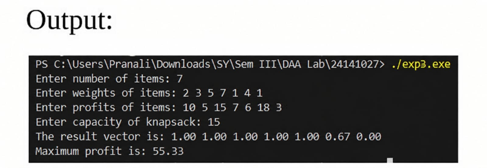

# Experiment No. 03

## Title
**Knapsack Problem Using Greedy Method**

### Analyse Time and Space Complexity

### Student Details
- **Email:** pranalihanamantbhopale1@gmail.com
- **GitHub:** https://github.com/pranalihanamantbhopale1-sudo/ExperimentNo3

---

## Aim

To implement the **Knapsack Problem using the Greedy Method** and analyze its time and space complexity.

---

## Program

```c
#include <stdio.h>

void knapsack(int n, float weight[], float profit[], float capacity)
{
    float ratio[20], totalProfit = 0, x[20];
    int i, j;
    float temp;

    for (i = 0; i < n; i++)
        ratio[i] = profit[i] / weight[i];

    for (i = 0; i < n - 1; i++)
    {
        for (j = i + 1; j < n; j++)
        {
            if (ratio[i] < ratio[j])
            {
                temp = ratio[j];
                ratio[j] = ratio[i];
                ratio[i] = temp;

                temp = weight[j];
                weight[j] = weight[i];
                weight[i] = temp;

                temp = profit[j];
                profit[j] = profit[i];
                profit[i] = temp;
            }
        }
    }

    for (i = 0; i < n; i++)
        x[i] = 0.0;

    float remaining = capacity;

    for (i = 0; i < n; i++)
    {
        if (weight[i] > remaining)
            break;
        else
        {
            x[i] = 1.0;
            totalProfit += profit[i];
            remaining -= weight[i];
        }
    }

    if (i < n)
    {
        x[i] = remaining / weight[i];
        totalProfit += x[i] * profit[i];
    }

    printf("The result vector is: ");

    for (i = 0; i < n; i++)
        printf("%.2f ", x[i]);

    printf("\nMaximum profit is: %.2f\n", totalProfit);
}

int main()
{
    float weight[20], profit[20], capacity;
    int n, i;

    printf("Enter number of items: ");
    scanf("%d", &n);

    printf("Enter weights of items: ");

    for (i = 0; i < n; i++)
        scanf("%f", &weight[i]);

    printf("Enter profits of items: ");

    for (i = 0; i < n; i++)
        scanf("%f", &profit[i]);

    printf("Enter capacity of knapsack: ");
    scanf("%f", &capacity);

    knapsack(n, weight, profit, capacity);

    return 0;
}
```

---

## Output



---

## Applications

1. Resource allocation problems where partial allocation is possible.
2. Cargo loading and inventory management systems.
3. Financial portfolio optimization for maximizing profit-to-risk ratios.
4. Data compression and bandwidth management applications.
5. Task scheduling and CPU time-sharing systems.

---

## Conclusion

From this experiment, I learned how the Greedy method efficiently solves the fractional Knapsack problem using the value-to-weight ratio and how its O(n log₂ n) complexity reflects the impact of sorting on optimization.
